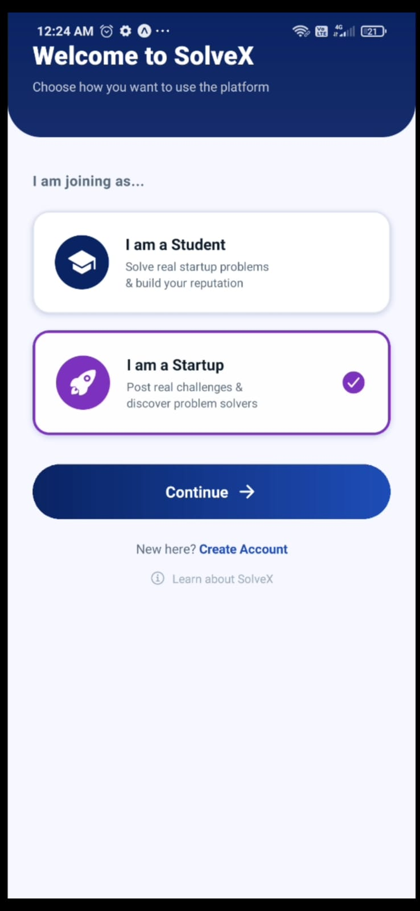
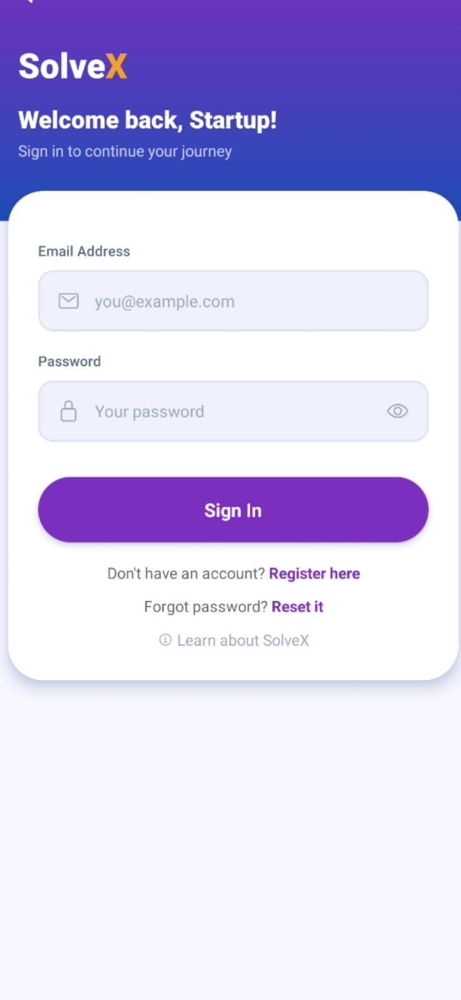
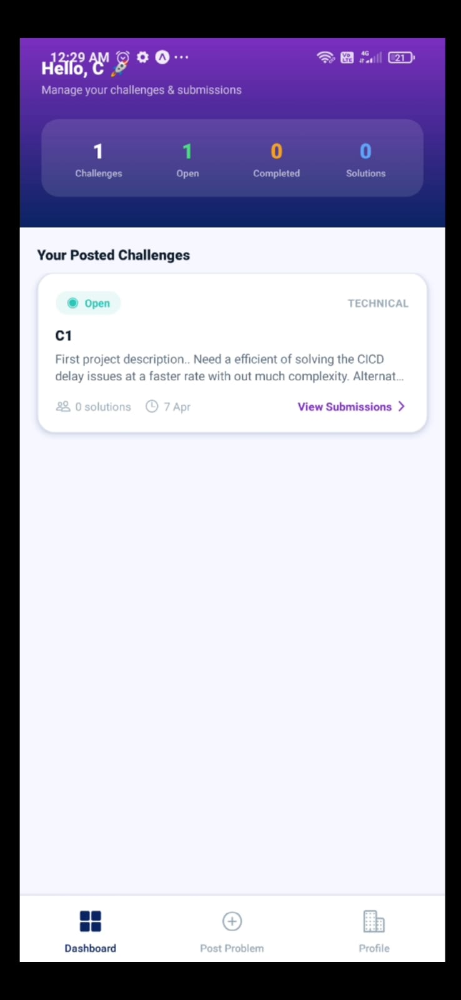
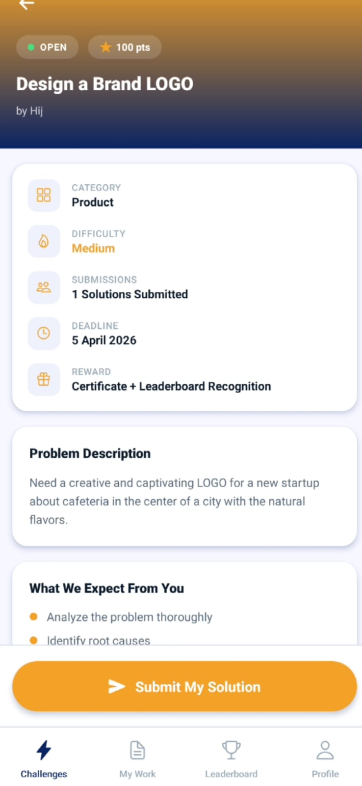
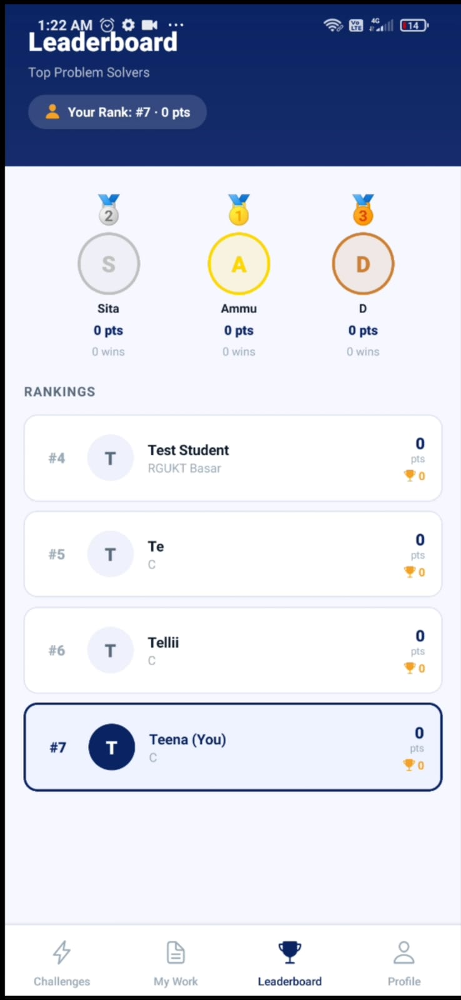
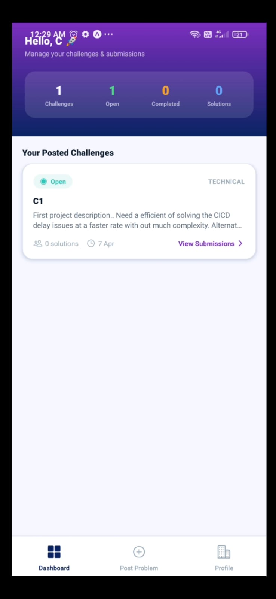
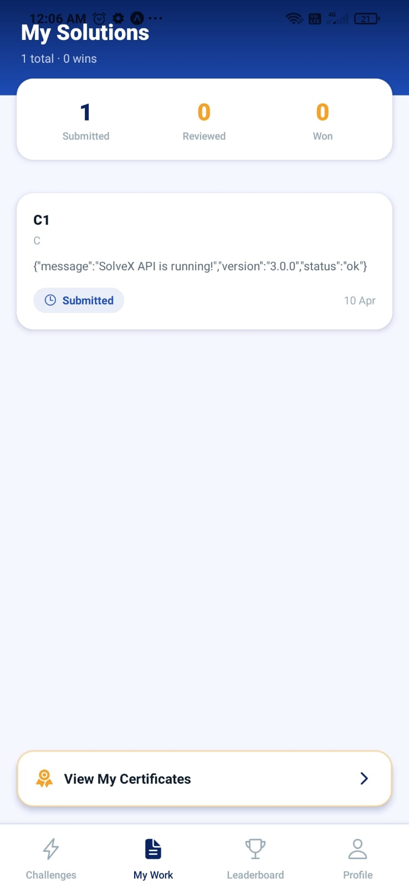
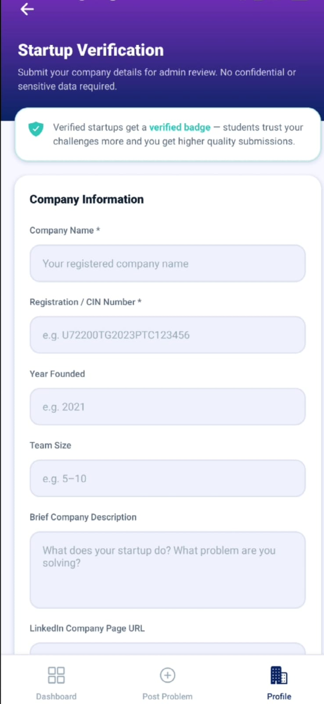

<div align="center">


# SolveX
### Where Real Problems Meet Smart Minds

[](https://reactnative.dev/)
[](https://expo.dev/)
[](https://nodejs.org/)
[](https://mongodb.com/)
[](https://expressjs.com/)
[](https://jwt.io/)

**A full-stack mobile application that bridges the gap between academic learning and real-world startup challenges.**

[Features](#-features) • [Architecture](#-architecture) • [Tech Stack](#-tech-stack) • [Screenshots](#-screenshots) • [Setup](#-local-setup) • [Team](#-team)

</div>

---

## 🎯 What is SolveX?

SolveX is a **role-based mobile platform** built for three types of users — Students, Startups, and Admins.

> Startups post their **real, unsolved internal problems** as challenges.  
> Students analyze and submit **structured solution approaches**.  
> The startup selects the best solution — the winner receives a **verified certificate**, **leaderboard points**, and a **winner badge** on their profile.

### What makes it different from a Hackathon?

| Hackathon | SolveX |
|-----------|--------|
| Problems designed by organizers | Problems come from inside the company's real operations |
| Judged by external judges | Judged by the startup that actually owns the problem |
| Time-limited event | Available anytime, ongoing |
| Prototype or code expected | Analytical written strategy — thinking, not building |
| One-time recognition | Permanent certificate with unique code on student profile |

---

## ✨ Features

### 🎓 Student Module
- Browse and filter open challenges by **category** and **difficulty**
- View full challenge details — problem description, deadline, reward points
- Submit structured **5-section solutions** — Approach, Root Cause, Proposed Fix, Implementation Plan, Expected Outcome
- Track all submissions and read **startup feedback**
- Earn **verified certificates** with unique certificate codes
- Compete on the **real-time leaderboard** ranked by points

### 🚀 Startup Module
- Register with company details and get a **Verified badge** after document submission
- Post real internal challenges with category, difficulty, deadline, and reward points
- Review all student submissions with full solution details
- Give **star ratings and written feedback** on each solution
- Select the best solution as winner — **certificate and points auto-awarded** to the student

### 🛡️ Admin Module
- Platform-wide **statistics dashboard** — users, challenges, solutions, winners
- **Manage user accounts** — suspend or reactivate
- **Verify startup** authenticity
- Delete inappropriate or violating challenges

---

## 🏗️ Architecture

```
┌─────────────────────────────────────────────────────┐
│               Mobile App (React Native)              │
│         Student UI | Startup UI | Admin UI           │
└────────────────────┬────────────────────────────────┘
                     │  HTTP Requests (Axios)
                     │  Authorization: Bearer <JWT>
                     ▼
┌─────────────────────────────────────────────────────┐
│            Backend Server (Node.js + Express)        │
│                                                      │
│  ┌─────────────────────────────────────────────┐    │
│  │         Auth Middleware (JWT Verify)         │    │
│  │     Checks token → Identifies user + role    │    │
│  └──────────────┬──────────────────────────────┘    │
│                 │                                    │
│  ┌──────────────▼──────────────────────────────┐    │
│  │              Controllers (MVC)               │    │
│  │  Auth | Challenge | Solution | Leaderboard   │    │
│  │        Admin | Profile                       │    │
│  └──────────────┬──────────────────────────────┘    │
└─────────────────┼───────────────────────────────────┘
                  │  Mongoose ODM
                  ▼
┌─────────────────────────────────────────────────────┐
│                  MongoDB Database                    │
│         Users | Challenges | Solutions               │
└─────────────────────────────────────────────────────┘
```

### Request Lifecycle
1. User performs an action on the phone
2. Axios sends HTTP request to `http://<PC_IP>:5000/api/...`
3. `authMiddleware.js` verifies the JWT token
4. Request routed to the correct controller
5. Controller queries MongoDB via Mongoose
6. JSON response sent back to phone
7. React Native re-renders the UI

### Winner Selection Flow (Core Feature)
```
Startup taps "Select as Winner"
        │
        ▼
PUT /api/challenges/:id/select-winner
        │
        ├── Marks solution.isWinner = true
        ├── Sets challenge.status = "winner_selected"
        ├── Generates certificateCode = "SOLVEX-XXXXXX-timestamp"
        ├── Pushes certificate to student.certificates[]
        └── Increments student.points + student.wins

Student refreshes → Certificate appears instantly ✅
```

---

## 🛠️ Tech Stack

### Frontend
| Technology | Version | Purpose |
|-----------|---------|---------|
| React Native | 0.81.5 | Cross-platform mobile app framework |
| Expo | SDK 54 | Dev toolchain — run on device via QR code |
| React Navigation | v6 | Stack + Bottom Tab navigators |
| Axios | ^1.5.1 | HTTP client with JWT interceptors |
| AsyncStorage | 2.2.0 | Persist token and user data on device |
| expo-linear-gradient | ~15.0.8 | UI gradient effects |
| expo-image-picker | ~17.0.10 | Camera and gallery for profile photos |
| react-native-toast-message | ^2.1.6 | In-app notifications |

### Backend
| Technology | Version | Purpose |
|-----------|---------|---------|
| Node.js | v20 | JavaScript runtime for server |
| Express.js | ^4.18.2 | REST API framework |
| Mongoose | ^7.5.0 | MongoDB ODM with schema validation |
| jsonwebtoken | ^9.0.2 | JWT generation and verification |
| bcryptjs | ^2.4.3 | Password hashing with salt |
| Nodemailer | ^6.9.8 | OTP email delivery via Gmail SMTP |
| dotenv | ^16.3.1 | Environment variable management |
| nodemon | ^3.1.14 | Auto-restart server on file changes |

### Database
| Technology | Purpose |
|-----------|---------|
| MongoDB | NoSQL document store |
| Collections: Users | Stores students, startups, admins |
| Collections: Challenges | Stores all posted problems |
| Collections: Solutions | Stores all student submissions |

---

## 📱 Screenshots

<div align="center">

### Auth Flow
| Splash Screen | Role Selection | Login |
|:---:|:---:|:---:|
|  |  |  |

### Student View
| Challenge List | Challenge Detail | Leaderboard |
|:---:|:---:|:---:|
|  |  |  |

### Startup View
| Dashboard | View Submissions | Verification |
|:---:|:---:|:---:|
|  |  |  |

</div>

---

## ⚙️ Local Setup

### Prerequisites
- Node.js v16+
- MongoDB running locally
- Expo Go app installed on your Android phone
- Both phone and PC on the same WiFi network

### 1. Clone the repository
```bash
git clone https://github.com/YOUR_USERNAME/SolveX.git
cd SolveX
```

### 2. Backend Setup
```bash
cd backend
npm install
```

Create a `.env` file in the backend folder:
```env
PORT=5000
MONGO_URI=mongodb://localhost:27017/solvex
JWT_SECRET=your_jwt_secret_key_here
JWT_EXPIRE=7d
NODE_ENV=development
EMAIL_USER=your_gmail@gmail.com
EMAIL_PASS=your_16_char_gmail_app_password
```

Start MongoDB and run the server:
```bash
sudo systemctl start mongod
npm run dev
```

✅ You should see:
```
✅ MongoDB connected
🚀 SolveX server running on port 5000
```

### 3. Frontend Setup
```bash
cd frontend
npm install
```

Open `src/utils/api.js` and update your PC's IP:
```javascript
// Find your IP: Windows → ipconfig | Linux → hostname -I
export const BASE_URL = 'http://YOUR_PC_IP:5000/api';
```

Start the app:
```bash
npx expo start --clear
```

Scan the QR code with **Expo Go** on your phone. ✅

### 4. Create Admin Account (first time only)
```bash
curl -X POST http://localhost:5000/api/auth/register \
  -H "Content-Type: application/json" \
  -d '{"name":"Admin","email":"admin@solvex.com","password":"admin123","role":"admin"}'
```

---

## 🗂️ Project Structure

```
SolveX/
├── backend/
│   ├── config/
│   │   └── db.js                    # MongoDB connection
│   ├── controllers/
│   │   ├── authController.js        # Register, Login, OTP, Reset
│   │   ├── challengeController.js   # CRUD + selectWinner logic
│   │   ├── solutionController.js    # Submit, feedback, my-solutions
│   │   ├── leaderboardController.js # Ranked student list
│   │   ├── adminController.js       # Stats, manage users
│   │   └── profileController.js    # View and update profiles
│   ├── middleware/
│   │   └── authMiddleware.js        # JWT verify + role check
│   ├── models/
│   │   ├── User.js                  # Student / Startup / Admin schema
│   │   ├── Challenge.js             # Challenge schema
│   │   └── Solution.js              # Solution schema
│   ├── routes/                      # URL → Controller mapping
│   ├── .env                         # Secrets (not pushed to GitHub)
│   └── server.js                    # Entry point
│
├── frontend/
│   ├── App.js                       # Root component
│   └── src/
│       ├── context/
│       │   └── AuthContext.js       # Global user state + token
│       ├── navigation/
│       │   ├── RootNavigator.js     # Role-based routing
│       │   ├── AuthNavigator.js     # Login / Register / Splash
│       │   ├── StudentNavigator.js  # Student tabs + stacks
│       │   ├── StartupNavigator.js  # Startup tabs + stacks
│       │   └── AdminNavigator.js    # Admin tabs
│       ├── screens/
│       │   ├── Auth/                # Splash, RoleSelect, Login, Register, ForgotPassword
│       │   ├── Student/             # Home, ChallengeDetail, Submit, MySolutions, Certificates, Leaderboard, Profile
│       │   ├── Startup/             # Dashboard, PostChallenge, ViewSubmissions, SolutionDetail, Profile, Verification
│       │   └── Admin/               # Dashboard, Users, Challenges
│       ├── components/
│       │   └── ChallengeCard.js     # Reusable challenge display card
│       ├── utils/
│       │   └── api.js               # Axios instance + interceptors
│       └── assets/
│           └── theme.js             # Colors, spacing, shadows
│
├── screenshots/                     # App screenshots for README
└── README.md
```

---

## 🔐 Security Implementation

- **Password Hashing** — bcryptjs with salt rounds before storing in MongoDB. Plain passwords never touch the database.
- **JWT Authentication** — Signed tokens with 7-day expiry. Verified on every protected route via middleware.
- **Role-Based Access Control** — Student, Startup, and Admin have separate route permissions enforced server-side.
- **OTP Password Reset** — 6-digit OTP generated server-side, emailed via Nodemailer, expires in 10 minutes.
- **Admin Protection** — Admin accounts cannot be created through the app UI — only via direct API call.

---

## 🐛 Challenges We Faced & How We Fixed Them

### 1. Red Screen Crash on Expo Go
**Error:** `TurboModuleRegistry.getEnforcing: PlatformConstants could not be found`  
**Root Cause:** React Native's new architecture requires `GestureHandlerRootView` as the root wrapper, and `react-native-reanimated/plugin` in babel config.  
**Fix:** Added `GestureHandlerRootView` in `App.js` and the Reanimated plugin to `babel.config.js`

### 2. Student Registration Silent Failure
**Problem:** Skills field was sent as a comma-separated string from the form, but MongoDB schema expected an array.  
**Fix:** Added conversion logic — `skills.split(',').map(s => s.trim()).filter(Boolean)` before sending to API.

### 3. Physical Phone Cannot Reach Backend
**Problem:** `localhost` or `127.0.0.1` doesn't resolve to the PC when called from a physical device.  
**Fix:** Used the PC's LAN IP address in `api.js` `BASE_URL`. Both devices must be on the same network.

### 4. Version Mismatches Breaking the App
**Problem:** `expo-image-picker`, `babel-preset-expo` and other packages had wrong versions for SDK 54.  
**Fix:** Used `npx expo install <package>` instead of `npm install` — Expo automatically picks the compatible version.

---

## 🔮 Future Enhancements

- [ ] Cloud deployment — Backend on Railway, Database on MongoDB Atlas
- [ ] Push notifications — Alert students when new challenges are posted
- [ ] Profile image persistence — Upload to Cloudinary instead of local device
- [ ] Structured scoring rubric — Auto-score solution completeness
- [ ] Cross-startup challenges — Multiple startups co-post similar domain problems

---

## 📄 Academic Details

> **Institution:** Rajiv Gandhi University of Knowledge Technologies, Basar  
> **Department:** Computer Science and Engineering  
> **Guide:** Mrs. D. Lingavva  
> **Academic Year:** 2024–2025

---

## 👩‍💻 Team

<div align="center">

| P. Navya | A. Bhuvitha | D. Sreeja |
|:---:|:---:|:---:|
| B210149 | B210115 | B210358 |

</div>

---

<div align="center">

**⭐ If you found this project useful, please give it a star!**

*"Unsolved problems reveal real skills." — SolveX*

</div>
